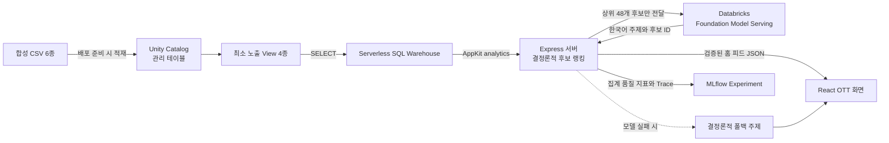

# SceneFlow의 Databricks 활용 구조

이 문서는 SceneFlow 코드베이스를 처음 접하는 한국인 개발자가 Databricks가 어디에서, 왜, 어떤 권한으로 사용되는지 이해하기 위한 안내서다. SceneFlow는 **Databricks App 위에서 실행되는 Node.js/React OTT 추천 데모**이며, Unity Catalog의 정제된 데이터를 SQL Warehouse로 읽고, 서버에서 안전한 추천 후보를 만든 뒤, Databricks Foundation Model이 후보를 여러 OTT 주제로 편성한다.

> 현재 추천기는 학습된 ML 모델이 아니다. 작은 합성 데이터셋에 맞춘 결정론적 랭커와 생성형 AI 큐레이션의 결합이며, 프로덕션 추천 정확도를 주장하지 않는다.

## 전체 데이터 흐름



핵심 원칙은 **데이터 접근, 추천 안전성, 표현 생성의 책임을 분리**하는 것이다. Unity Catalog와 SQL Warehouse가 데이터 접근을 담당하고, TypeScript 랭커가 시청 이력 제외와 후보 선정을 보장하며, Foundation Model은 이미 검증된 후보를 주제로 묶는 역할만 맡는다.

## 1. Unity Catalog: 원천 데이터와 앱 노출 데이터 분리

[`scripts/provision-data.ps1`](../scripts/provision-data.ps1)은 합성 CSV 6종을 `media_dev.ott_recommendations`의 관리 테이블로 적재한다.

| 원천 테이블       | 내용                                   |
| ----------------- | -------------------------------------- |
| `users`           | 합성 사용자 프로필                     |
| `movies`          | 영화 메타데이터와 줄거리·키워드        |
| `viewing_history` | 시청 시간, 완주율, 재시청 등 행동 신호 |
| `user_reviews`    | 사용자 평점과 리뷰                     |
| `critic_reviews`  | 평론가 점수와 리뷰                     |
| `critics`         | 평론가 프로필                          |

앱 서비스 주체는 원천 테이블 전체를 직접 읽지 않는다. 스크립트가 다음 네 개의 읽기 전용 View를 만들고 앱에는 이 View와 `movies` 테이블만 노출한다.

- `consumer_profiles`: 활성 사용자의 앱 표시·취향 필드만 포함한다.
- `viewer_interactions`: 시청 이력에 사용자 평점과 리뷰를 결합한다.
- `movie_quality_signals`: 작품별 완주율, 재시청률, 사용자·평론가 평가를 집계한다.
- `critic_commentary`: 평론가 연락처를 제외하고 화면에 필요한 코멘트만 제공한다.

런타임 쿼리는 [`server/catalog-repository.ts`](../server/catalog-repository.ts)에 모여 있다. 카탈로그와 스키마는 [`server/config.ts`](../server/config.ts)가 환경 변수에서 읽고 소문자 `snake_case` 식별자만 허용하므로, SQL 식별자 주입과 환경별 경로 하드코딩을 피한다. 조회된 카탈로그 스냅샷은 앱 프로세스에서 5분간 캐시해 Warehouse 호출을 줄인다.

## 2. SQL Warehouse와 AppKit Analytics: 앱의 데이터 읽기 경계

[`server/server.ts`](../server/server.ts)는 Databricks AppKit의 `analytics()` 플러그인을 등록하고 `appkit.analytics.query()`를 `CatalogRepository`에 주입한다. 이 구조 덕분에 다음 책임이 분리된다.

- AppKit: Databricks 통합 인증과 SQL 실행을 담당한다.
- `CatalogRepository`: SQL과 Databricks 응답을 도메인 객체로 변환한다.
- 추천 엔진: Databricks 클라이언트를 모르며 메모리의 `CatalogSnapshot`만 받는다.

따라서 추천 단위 테스트는 실제 Workspace나 Warehouse 없이 실행할 수 있다. 배포 시 Warehouse ID는 코드가 아니라 [`app.yaml`](../app.yaml)의 `DATABRICKS_WAREHOUSE_ID` 바인딩으로 주입된다.

## 3. 서버 추천 엔진: 설명 가능하고 안전한 후보 생성

[`server/recommendation-engine.ts`](../server/recommendation-engine.ts)는 Unity Catalog에서 읽은 신호로 서버 안에서 결정론적 점수를 계산한다.

1. 해당 사용자가 이미 시청한 작품을 추천 후보에서 제외한다.
2. 명시적 평점이 있으면 이를 우선하고, 없으면 완주율과 재시청으로 선호 신호를 만든다.
3. 선호·비선호 작품과 후보의 장르, 배경, 갈등, 키워드, 로그라인 유사도를 비교한다.
4. 사용자의 선호 장르, 작품 품질 집계, 인기도, 오리지널 여부를 보조 신호로 더한다.
5. 추천 이유와 근거를 구조화해 클라이언트에 함께 반환한다.

인구통계 필드는 랭킹에 사용하지 않는다. Foundation Model에 넘길 때도 상위 48개의 미시청 후보, 선호 장르, 시청 시간대, 기기 맥락, 긍정 시청 앵커만 포함한다.

## 4. Foundation Model Serving: 후보를 OTT 주제로 편성

[`server/ai-curation.ts`](../server/ai-curation.ts)는 Databricks Foundation Model을 자유 생성 추천기가 아니라 **제한된 편성기**로 사용한다. [`server/server.ts`](../server/server.ts)는 AppKit 실행 컨텍스트의 SDK 클라이언트로 바인딩된 Serving Endpoint를 호출한다.

- 입력: 결정론적 랭커가 고른 후보 48개와 합성 취향 신호
- 출력: 한국어 주제 4개와 주제별 후보 영화 ID 8개
- 검증: Zod 스키마, 알려진 후보 ID 여부, 주제 간 중복, 최소 영화 수
- 캐시: AI 결과는 사용자별 30분 캐시
- 장애 대응: 잘못된 JSON, 알 수 없는 ID, Endpoint 오류가 발생하면 결정론적 네 개 주제를 반환

첫 홈 요청은 모델 응답을 기다리지 않고 폴백 주제를 `ai-pending` 상태로 즉시 보낸다. 클라이언트가 `/api/curation/:userId`를 조회하면 완료된 AI 주제로 교체한다. 이 방식은 모델 지연이 소비자 화면 전체를 막지 않게 한다.

## 5. Databricks App: 실행, 인증, 자원 바인딩

[`databricks.yml`](../databricks.yml)은 `media-ott-consumer-app`과 필요한 Workspace 자원을 선언한다. [`app.yaml`](../app.yaml)은 배포된 앱 프로세스의 시작 명령과 환경 변수 바인딩을 정의한다.

앱 서비스 주체의 런타임 권한은 다음으로 제한된다.

| 자원                      | 권한        | 목적                |
| ------------------------- | ----------- | ------------------- |
| SQL Warehouse             | `CAN_USE`   | 읽기 전용 SQL 실행  |
| Foundation Model Endpoint | `CAN_QUERY` | AI 주제 생성        |
| MLflow Experiment         | `CAN_EDIT`  | 평가·Trace 기록     |
| 앱 노출 테이블·View 5개   | `SELECT`    | 홈 피드와 리뷰 구성 |

소스 CSV가 있는 Volume에는 앱 런타임 쓰기 권한을 부여하지 않는다. Workspace host, 토큰, Warehouse ID, Endpoint 이름, 카탈로그 경로도 애플리케이션 코드에 하드코딩하지 않는다. 로컬에서는 `.env`와 Databricks CLI 프로필을 사용하고, 배포 환경에서는 App 자원 바인딩과 통합 인증을 사용한다.

## 6. MLflow: 추천 품질 평가와 AI 모니터링

[`server/recommendation-evaluation.ts`](../server/recommendation-evaluation.ts)는 현재 TypeScript 랭커를 그대로 호출해 시간순 leave-one-out 평가를 수행한다. 각 합성 사용자의 가장 최근 긍정 반응 작품 하나를 숨기고, 이전 선호 이력만으로 만든 상위 10개 추천에 숨긴 작품이 나타나는지 측정한다.

| 지표                  | 의미                                                                |
| --------------------- | ------------------------------------------------------------------- |
| `Recall@10`           | 숨긴 긍정 작품이 상위 10개에 포함된 사용자 비율                     |
| `MRR@10`              | 숨긴 작품이 상위에 있을수록 높아지는 역순위 평균                    |
| `NDCG@10`             | 순위가 뒤로 갈수록 할인해 계산한 랭킹 품질                          |
| `Catalog Coverage@10` | 평가 사용자들의 상위 10개 추천이 전체 카탈로그를 얼마나 덮는지 측정 |

[`server/mlflow-monitoring.ts`](../server/mlflow-monitoring.ts)는 다음 두 종류의 MLflow Trace를 전용 Experiment에 기록한다.

- `sceneflow.recommendation_offline_evaluation`: 위 네 지표, 평가·제외 사용자 수, 데이터 규모, 평가 시간
- `sceneflow.ai_curation`: Foundation Model/폴백 출처, 지연 시간, 주제·영화 수, 영화 ID 고유 비율, 폴백 여부

오프라인 평가는 카탈로그 스냅샷을 읽은 요청이 있을 때 최대 30분에 한 번 백그라운드에서 실행된다. AI Trace는 캐시되지 않은 실제 큐레이션 시도마다 생성된다. 사용자 ID, 원문 프롬프트, 리뷰, 모델 원문 응답, 전체 추천 목록은 MLflow에 보내지 않는다.

[`databricks.yml`](../databricks.yml)은 `/Shared/media-ott-recommendations-monitoring` Experiment를 만들고 앱에 `CAN_EDIT`만 부여한다. [`app.yaml`](../app.yaml)은 바인딩된 ID를 `MLFLOW_EXPERIMENT_ID`로 주입한다. 로컬에서 이 변수가 없으면 평가 함수는 실행할 수 있지만 Trace 전송은 no-op이다.

이 평가는 합성 과거 데이터의 방향성 지표이지 실제 클릭·재생 전환의 인과 효과가 아니다. 특히 집계 품질 신호에는 숨긴 사용자의 기여가 남아 있으므로, 프로덕션 전에는 시간 기준 데이터 스냅샷과 온라인 실험을 추가해야 한다.

2026-08-19에 현재 Unity Catalog 스냅샷으로 실행한 첫 기준선은 다음과 같다. 300명 중 이전 긍정 이력이 있는 298명을 평가했으며, `Recall@10=0.0403`, `MRR@10=0.0141`, `NDCG@10=0.0201`, `Catalog Coverage@10=0.8550`이었다. 합성 상호작용에서는 순위 예측력이 낮고 추천 범위는 넓다는 뜻이다. 이 값은 개선 전 비교 기준이지 프로덕션 합격선이 아니다.

## 7. 요청 한 건을 따라가 보기

`GET /api/home/USR0001` 요청의 실행 순서는 다음과 같다.

1. Express 라우트가 사용자 ID 형식을 검사한다.
2. `CatalogRepository`가 AppKit Analytics를 통해 다섯 개 데이터 객체를 병렬 조회한다. 5분 캐시가 있으면 재사용한다.
3. 추천 엔진이 미시청 작품을 랭킹하고 AI 입력 컨텍스트를 만든다.
4. 사용자별 AI 캐시가 없으면 결정론적 주제를 즉시 응답하고 Foundation Model 호출을 백그라운드에서 시작한다.
5. 모델 응답은 허용된 후보 ID만 남도록 검증되고 30분간 캐시된다.
6. 클라이언트가 큐레이션 API를 조회해 AI 주제로 홈 화면을 갱신한다.

7. 현재 스냅샷의 추천 품질 평가가 30분 이내에 실행되지 않았다면 MLflow 평가 Trace를 백그라운드에서 기록한다.

## 8. 개발과 검증

환경 준비 상태는 다음 명령으로 확인한다.

```powershell
pwsh ./scripts/doctor.ps1
```

로컬 실행에는 `.env`의 Workspace host, CLI 프로필, Warehouse ID, Serving Endpoint 이름, 카탈로그·스키마가 필요하다. `.env`와 Databricks 자격 증명은 커밋하지 않는다.

```powershell
npm ci
npm run dev
```

코드 변경 후에는 로컬 품질 검사와 Databricks 구성 검증을 수행한다.

```powershell
npm run format
npm run lint
npm run typecheck
npm test
npm run build
databricks apps validate --skip-tests -p <profile> --var "sql_warehouse_id=<warehouse-id>"
databricks apps validate -p <profile> --var "sql_warehouse_id=<warehouse-id>"
databricks bundle validate -t dev -p <profile> --var "sql_warehouse_id=<warehouse-id>"
```

배포는 Workspace 상태를 변경하므로 대상 프로필, 앱, 변수의 영향을 확인한 뒤 별도로 수행한다.

## 현재 한계와 확장 지점

- 합성 사용자 300명과 영화 200편을 위한 데모이므로 전체 카탈로그를 앱 메모리에 올린다. 실제 규모에서는 후보·피처 사전 계산이나 Serving Endpoint가 필요하다.
- 랭커는 학습 모델이 아니며 온라인 A/B 테스트나 실제 클릭·재생 전환을 수집하지 않는다.
- 사용자 선택기는 영업 데모용이며 프로덕션 인증·사용자 식별 설계가 아니다.
- AI 주제의 형식과 후보 안전성은 코드 지표로 모니터링하지만, 표현의 자연스러움은 아직 사람 또는 LLM Judge 평가가 없다.

제품 가정과 성공 지표는 [`docs/IDEATION.md`](IDEATION.md), 아키텍처 결정은 [`docs/adr/0001-consumer-ott-app-architecture.md`](adr/0001-consumer-ott-app-architecture.md), [`docs/adr/0002-ai-personalized-theme-curation.md`](adr/0002-ai-personalized-theme-curation.md), [`docs/adr/0003-mlflow-recommendation-monitoring.md`](adr/0003-mlflow-recommendation-monitoring.md)에서 확인할 수 있다.
